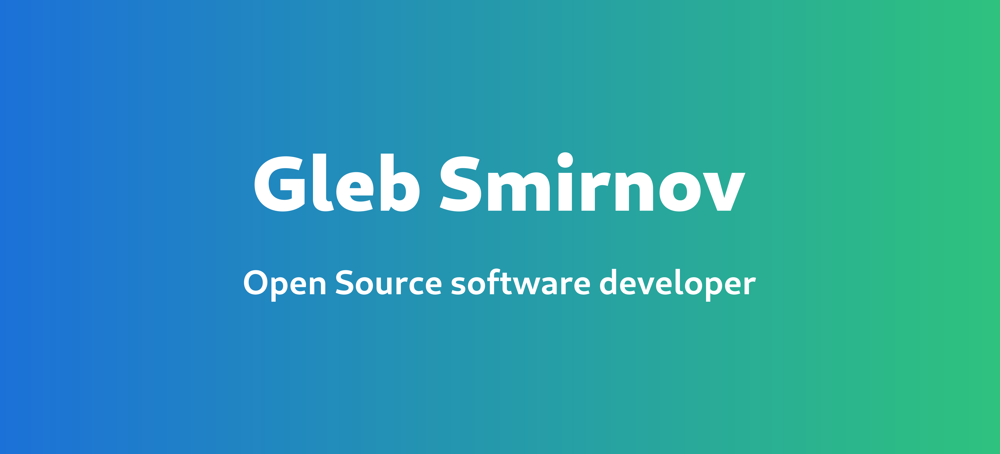

<!-- Badges -->

# About me 🙋‍♂️

Hi, I am Gleb Smirnov, 16 y.o. software developer who really want to make this world better. 
I love Open Source, programming and tea. I am Linux and GNOME fan.

# My skills

**Fun fact about me:** I'm 5 years in programming, but I believe that my birth as software developer is 2021 year.
It's when I started to create real projects, contribute to other projects and develop my skills.

## Python

I practice Python for 5 years.

I can write GUI apps in Python via Tkinter, PyQt5, GTK.

I tried myself in writing Telegram bots. My goal was creating a bot which will execute some common Unix commands (like `sed` and `awk`) right on messages.
But I couldn't solve some security problems, which I think I can solve now, but now I have no server to host this bot.

<a href="https://github.com/liferooter/streameditbot">

<a/>  

I was developing simple tank game using Pygame with my friend:

<a href="https://github.com/liferooter/pytanchiks">

<a/>  

I developed yet another game using Pygame, but it's the simplest platformer-shooter ever developed in three days in my free time
from nothing-to-do on holydays. It's not really finished game project, it's just playable MVP. I am not going to continue it's development.

<a href="https://github.com/liferooter/cubanjumper">

<a/>  

I also contributed to some GTK Python project, such as [Meowgram](https://github.com/ExposedCat/Meowgram) and [Lollypop](https://gitlab.gnome.org/World/lollypop)

## GTK and GNOME

...

## Vala

...

## C

...

## Linux

...

<!--
**liferooter/liferooter** is a ✨ _special_ ✨ repository because its `README.md` (this file) appears on your GitHub profile.

Here are some ideas to get you started:

- 🔭 I’m currently working on ...
- 🌱 I’m currently learning ...
- 👯 I’m looking to collaborate on ...
- 🤔 I’m looking for help with ...
- 💬 Ask me about ...
- 📫 How to reach me: ...
- 😄 Pronouns: ...
- ⚡ Fun fact: ...
-->
